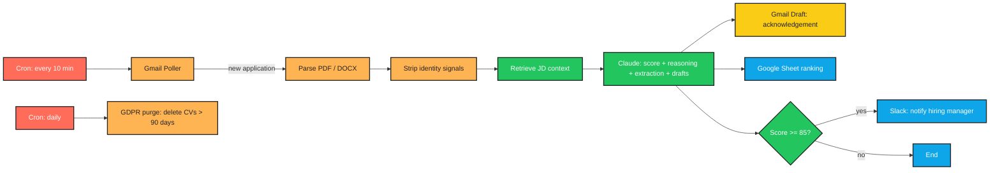

# CLAUDE.md — CV Screening & Hiring Agent

> **Language:** Python (3.10+)
> **Client:** David A., Founder — BuildRight Recruitment Agency
> **Budget:** $2,500–5,000 | **Timeline:** 2–3 weeks

---

## 1. Project Overview

BuildRight is a recruitment agency handling 15–20 open roles at any time, each receiving 50–200 applications. Recruiters spend 60–70% of their day on initial CV screening — repetitive, inconsistent, and demoralizing work.

We are building an agent that:

- **Monitors the applications inbox** and parses CVs (PDF + DOCX)
- **Scores each candidate** against the job description (0–100 with reasoning)
- **Extracts** experience, skills, education, location, notice period
- **Drafts** personalized acknowledgement emails (for human approval)
- **Produces** a one-page candidate brief for the hiring manager
- **Ranks** all candidates for a role in a live Google Sheet
- **Flags** standout candidates immediately via Slack

**Humans make all final decisions.** The agent removes grunt work — it does not make hiring calls.

---

## 2. Required Features

| # | Feature | Notes |
|---|---------|-------|
| 1 | Monitor applications inbox, parse CV from PDF or Word | Gmail label-based pickup |
| 2 | Score each candidate 0–100 with reasoning | Use RAG over the job description |
| 3 | Extract: experience, skills, education, location, notice period | Structured Pydantic output |
| 4 | Draft personalized acknowledgement email | Saved as Gmail draft — never sent |
| 5 | Produce one-page candidate brief for hiring manager | Markdown / PDF |
| 6 | Rank candidates for a role in a live Google Sheet | One sheet per role |
| 7 | Flag standout candidates immediately via Slack | Score >= 85 or hiring manager flag |

---

## 3. Important Constraints

- **Transparency:** Every score must show its reasoning. No black-box "this candidate scored 78." The brief must say *why*.
- **Bias control:** No bias based on name, gender, age, or nationality. Strip these signals from the CV before sending to Claude where reasonable, and use bias-aware prompting.
- **No auto-send:** Rejection emails are drafted only — never sent automatically. A human approves before send.
- **GDPR compliance:** CVs are not stored longer than **90 days**. A purge job must enforce this.
- **AI disclosure:** Must disclose to applicants that AI is used in initial screening (include the disclosure in the acknowledgement email template).

---

## 4. Tech Stack

```
Python 3.10+    |   Gmail API           |   Claude API
pypdf           |   python-docx         |   Pydantic
Google Sheets   |   Slack API           |   Pinecone (RAG over JD)
                |   (gspread)           |
APScheduler (purge job)
```

---

## 5. Architecture

```
   ┌─────────────────────────────────────────────────────────┐
   │  GMAIL INBOX (label: "Applications/<RoleName>")          │
   └─────────────────────────────────────────────────────────┘
                          │
                          ▼
   ┌─────────────────────────────────────────────────────────┐
   │              INBOX POLLER                               │
   │  - Polls every 10 min                                   │
   │  - Detects new application emails                       │
   │  - Routes by Gmail label to the matching role           │
   └─────────────────────────────────────────────────────────┘
                          │
                          ▼
   ┌─────────────────────────────────────────────────────────┐
   │              CV PARSER                                   │
   │  - Detect attachment type (PDF / DOCX)                  │
   │  - Extract text via pypdf or python-docx                │
   │  - Normalize whitespace                                  │
   │  - Strip identity signals (name, gender, age, nationality)│
   │    into a separate field so Claude scores blind          │
   └─────────────────────────────────────────────────────────┘
                          │
                          ▼
   ┌─────────────────────────────────────────────────────────┐
   │         JOB DESCRIPTION RAG                              │
   │  - JD chunked + embedded into Pinecone (per role)        │
   │  - Retrieve relevant JD sections for each CV section     │
   └─────────────────────────────────────────────────────────┘
                          │
                          ▼
   ┌─────────────────────────────────────────────────────────┐
   │                CLAUDE SCORER                             │
   │  Returns structured JSON:                                │
   │    - score (0–100)                                       │
   │    - reasoning (explicit, multi-point)                   │
   │    - extracted fields (exp, skills, edu, loc, notice)    │
   │    - acknowledgement_email_draft                         │
   │    - one_page_brief                                      │
   │  Bias-aware prompt: explicitly told to ignore name,      │
   │  gender, age, nationality                                │
   └─────────────────────────────────────────────────────────┘
                          │
            ┌─────────────┴─────────────┐
            ▼                           ▼
   ┌────────────────────┐    ┌──────────────────────────────┐
   │ Gmail DRAFT        │    │ Google Sheet (role's ranking)│
   │ acknowledgement    │    │ live, sorted by score        │
   └────────────────────┘    └──────────────────────────────┘
                          │
                          ▼
   ┌─────────────────────────────────────────────────────────┐
   │            STANDOUT FLAGGER                              │
   │  If score >= 85 → Slack DM to hiring manager             │
   │  Attach the one-page brief                                │
   └─────────────────────────────────────────────────────────┘

   ┌─────────────────────────────────────────────────────────┐
   │       GDPR PURGE JOB (daily)                             │
   │  Delete CV files + DB rows older than 90 days            │
   └─────────────────────────────────────────────────────────┘
```

---

## 6. Development Workflow

```
┌──────────────────────────────────────────────────────────────┐
│                  DEVELOPMENT WORKFLOW                        │
└──────────────────────────────────────────────────────────────┘

  STEP 1 — PLAN
    • Read this CLAUDE.md fully before writing code
    • Pick ONE component to build first (suggest: CV parser)
    • Use a small folder of sample CVs (anonymized) for dev

  STEP 2 — IMPLEMENT (Python)
    • All secrets via environment variables
    • Use Pydantic for the Claude output schema — reject any
      response missing the "reasoning" field
    • Strip identity signals BEFORE the LLM call
    • Log every email picked up (sender hash, role, timestamp)
      but NEVER log raw CV content (PII)
    • Wrap every API call in try/except with specific exceptions

  STEP 3 — RUN THE SCRIPT
    • Run end-to-end against a folder of 5–10 sample CVs first
    • Verify: NO rejection emails sent — only drafts created
    • Verify: Google Sheet updates with correct ranking
    • Verify: standout Slack alerts only fire for high scorers

  STEP 4 — IF YOU HIT AN ERROR ────────────────────────────────
    │
    │  4a. READ THE FULL ERROR MESSAGE AND TRACEBACK
    │      ─ Do NOT skip lines
    │      ─ Read every line of the traceback, top to bottom
    │      ─ Identify:
    │           • Exact file and line number
    │           • Exception type
    │           • The actual value that caused the failure
    │      ─ For PDF parsing errors: log the file name + size,
    │        try a different parser (pdfplumber fallback) and
    │        record which CVs require fallback
    │      ─ For Claude validation errors (Pydantic): log the
    │        raw response text BEFORE parse, identify the
    │        missing/malformed field
    │      ─ For Gmail/Sheets quota errors: log quota usage
    │
    │  4b. FIX THE SCRIPT
    │      ─ Find the root cause — do NOT guess
    │      ─ Re-read the function being edited end to end
    │      ─ Make the smallest possible targeted fix
    │      ─ If the bug came from a malformed Claude response,
    │        also tighten the prompt and the schema
    │      ─ If the bug touches PII handling, treat as P0:
    │        verify no PII leaked to logs, the Sheet, or Slack
    │
    │  4c. RETEST
    │      ─ Re-run the full pipeline, not just the failing step
    │      ─ Confirm the original error is gone
    │      ─ Run edge cases:
    │           • Scanned PDF (image-based, no text layer)
    │           • CV with no contact info
    │           • CV with extreme length (10+ pages)
    │           • Candidate clearly underqualified (score < 30)
    │           • Candidate clearly standout (score >= 90)
    │      ─ Verify NO email was actually sent — only drafts
    │
    │  4d. DOCUMENT WHAT YOU LEARNED
    │      ─ Append an entry to the "## Error Log" section below
    │      ─ Use the template provided
    │      ─ One sentence "Lesson learned" — make it concrete
    │      ─ If the lesson touches bias or PII, also add a note
    │        in the README troubleshooting section
    │
    └─────────────────────────────────────────────────────────

  STEP 5 — VALIDATE OUTPUT
    • Every score has multi-point reasoning visible in the brief
    • No identity signals (name/gender/age/nationality) influenced
      the score — spot-check by comparing two CVs that differ
      ONLY in name
    • All rejection emails are DRAFTS (check Gmail Drafts folder)
    • AI disclosure line present in every acknowledgement template
    • Google Sheet sorted correctly, descending by score
    • GDPR purge job runs and actually deletes 91-day-old records
      (test with a manually backdated record)

  STEP 6 — GENERATE README.md
    • See section "## 8. README.md Requirements" below
```

---

## 7. Error Log

> Every bug encountered MUST be logged here. This is non-negotiable.

### Entry Template

```
### [YYYY-MM-DD] — [short title]

**Error Type:** e.g. `pydantic.ValidationError`

**Full Error Message:**
\```
Paste the LAST 5–10 lines of the traceback verbatim.
For Pydantic errors include the field path and offending value.
For Gmail/Sheets errors include the full HttpError JSON body.
NEVER paste raw CV content — anonymize before logging.
\```

**What I Was Doing:**
The action being performed when the error fired (e.g. "scoring
candidate for role 'Senior Backend Engineer' with a 4-page PDF
CV at 11:32am").

**Root Cause:**
The actual underlying cause. Not the symptom.

**Fix Applied:**
The exact code change. Reference the function and file.

**Lesson Learned:**
One concrete sentence. If the lesson involves PII or bias,
mark it [PII] or [BIAS] so it stands out.
```

---

## 8. README.md Requirements

After the project is functional, generate a `README.md` file in the project root. The README must include an **n8n-style workflow / architecture graphic** so David and the recruiters can understand the screening pipeline and trust the safety guarantees.

### Required README sections

1. **Project title + 1-line tagline**
2. **What it does** (3–5 sentences, non-technical)
3. **Workflow diagram** — render as an **n8n-style node graph** using Mermaid `flowchart LR`. Each step is a discrete tile. Color-code by node type: trigger, parse, AI, human-review-required, output.
4. **Safety guarantees** — explicit numbered list:
   - Rejection emails are drafted only, never auto-sent
   - All scores show their reasoning
   - Identity signals are stripped before scoring
   - CVs purged after 90 days (GDPR)
   - AI disclosure included in every acknowledgement template
5. **Tech stack table**
6. **Folder structure**
7. **Setup instructions** — clone, venv, install, OAuth setup, env vars
8. **Environment variables** — table of every var
9. **Configuration** — how to add a new role (JD + Gmail label + Sheet)
10. **Running locally** — single command for a one-shot pass over a sample folder
11. **Scheduling** — inbox polling + daily GDPR purge job
12. **Bias audit procedure** — how recruiters verify the agent stays fair
13. **Troubleshooting** — common errors and fixes (sourced from the Error Log)

### Mermaid template for the workflow graphic



> **Important:** The README should render correctly on GitHub. Preview before final commit.

---

## 9. Python Project Conventions

- **Folder structure:**
  ```
  /src
    /inbox            # Gmail poller
    /parser           # PDF + DOCX extractors, identity stripper
    /jd_rag           # JD ingestion + Pinecone retrieval
    /scorer           # Claude wrapper + Pydantic schema + bias-aware prompt
    /outputs
      gmail.py        # draft acknowledgement
      sheets.py       # update ranking sheet
      slack.py        # standout notification
    /gdpr             # 90-day purge job
    /scheduler        # APScheduler entrypoint
    /db               # candidate records (sqlite)
  /tests
    /fixtures
      cvs/            # anonymized sample CVs
      jds/            # sample job descriptions
  .env.example
  requirements.txt
  README.md
  CLAUDE.md
  ```
- **Pydantic schema** for Claude's output — required fields: `score`, `reasoning` (list[str], >=3 items), `experience`, `skills`, `education`, `location`, `notice_period`, `acknowledgement_email_draft`, `one_page_brief`. Reject any response missing reasoning.
- **PII handling:** Never log raw CV content. Log only candidate IDs (hash of email + timestamp). Storage uses field-level access control.
- **Bias controls:**
  - Identity-stripping pass before LLM call.
  - Bias-aware prompt explicitly forbids name/gender/age/nationality reasoning.
  - Periodic "twin CV" audit: same CV with two different names should score within ±2 points.
- **GDPR purge:** Daily APScheduler job. Delete candidate records, attachments, and Pinecone entries older than 90 days. Log purge counts.
- **Type hints:** Required.
- **Tests:** `pytest` with mocked Gmail/Sheets/Slack clients. Include a "twin CV" bias test as a unit test.
