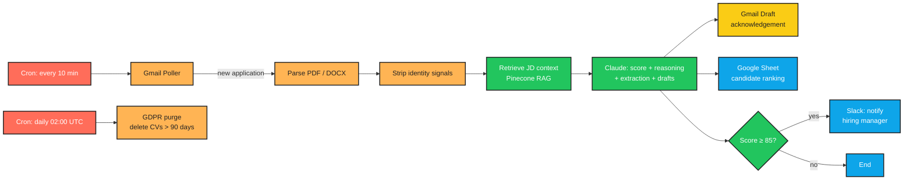

# CV Screening & Hiring Agent

> **AI-assisted candidate screening that removes grunt work — not human judgement.**

Built for BuildRight Recruitment Agency. Monitors Gmail for new applications, parses CVs, scores each candidate against the job description using Claude, and surfaces ranked results to recruiters — with full reasoning, zero auto-sends, and GDPR compliance built in.

---

## What It Does

BuildRight handles 15–20 open roles simultaneously, each receiving up to 200 applications. Recruiters were spending 60–70% of their day on initial CV screening — repetitive, inconsistent work that left little time for candidate relationship-building.

This agent takes over that first pass. It reads every incoming CV, extracts key data, scores the candidate 0–100 against the role's requirements, and writes a one-page brief for the hiring manager — all within minutes of the application arriving.

Humans make every hiring decision. The agent removes the paperwork.

---

## Workflow Diagram



| Node colour | Meaning |
|-------------|---------|
| 🔴 Red | Trigger / cron |
| 🟠 Orange | Parse / transform |
| 🟢 Green | AI processing |
| 🟡 Yellow | Requires human review before action |
| 🔵 Blue | Output / storage |

---

## Safety Guarantees

1. **Rejection emails are drafted only — never auto-sent.** Every email lives in Gmail Drafts until a recruiter clicks Send.
2. **Every score shows its reasoning.** Claude is required (via tool-use schema) to produce ≥3 explicit bullet points linking each score point to a specific job requirement.
3. **Identity signals are stripped before scoring.** Name, email, phone, LinkedIn, age, and nationality are removed from the CV text before it reaches Claude. The scorer never sees the candidate's name.
4. **CVs are purged after 90 days (GDPR).** A daily APScheduler job deletes attachment files, brief files, and nulls personal data fields — while retaining an anonymised audit row.
5. **AI disclosure in every acknowledgement.** The Pydantic schema rejects any Claude response whose draft email is missing the AI disclosure statement.

---

## Tech Stack

| Layer | Technology |
|-------|-----------|
| Language | Python 3.10+ |
| AI / LLM | Anthropic Claude (`claude-sonnet-4-6`) |
| Structured output | Claude tool use + Pydantic v2 |
| Embeddings | OpenAI `text-embedding-3-small` |
| Vector DB | Pinecone (serverless) |
| Email | Gmail API (OAuth 2.0) |
| Spreadsheet | Google Sheets API (gspread + service account) |
| Notifications | Slack Web API (`slack-sdk`) |
| CV parsing | pypdf + pdfplumber (fallback) + python-docx |
| Scheduling | APScheduler 3.x |
| Database | SQLite (via stdlib `sqlite3`) |
| Retry logic | Tenacity |
| Testing | pytest + pytest-mock |

---

## Folder Structure

```
cv-screening-agent/
├── src/
│   ├── inbox/          # Gmail poller — detects new applications
│   ├── parser/         # PDF/DOCX extractor + identity stripper
│   ├── jd_rag/         # JD ingestion into Pinecone + context retrieval
│   ├── scorer/         # Claude wrapper, Pydantic schema, bias-aware prompt
│   ├── outputs/
│   │   ├── gmail.py    # Draft acknowledgement emails (NEVER sends)
│   │   ├── sheets.py   # Live candidate ranking spreadsheet
│   │   └── slack.py    # Standout candidate alerts
│   ├── gdpr/           # 90-day purge job
│   ├── scheduler/      # APScheduler entrypoint
│   └── db/             # SQLite models + CRUD operations
├── tests/
│   ├── fixtures/
│   │   ├── cvs/        # Anonymised sample CVs (txt for CI, real PDFs locally)
│   │   └── jds/        # Sample job descriptions
│   ├── test_parser.py
│   ├── test_scorer.py
│   ├── test_outputs.py
│   ├── test_gdpr.py
│   └── test_bias.py    # Twin CV bias audit test
├── data/
│   ├── attachments/    # Downloaded CV files (auto-purged after 90 days)
│   └── briefs/         # One-page Markdown briefs
├── main.py             # One-shot poll trigger
├── run_sample.py       # Local sample runner (no Gmail/Sheets/Slack)
├── setup_role.py       # Role configuration wizard
├── requirements.txt
├── pyproject.toml
├── .env.example
└── CLAUDE.md           # Project specification
```

---

## Setup Instructions

### 1. Clone and create virtual environment

```bash
git clone https://github.com/your-username/cv-screening-agent.git
cd cv-screening-agent
python -m venv .venv
# Windows
.venv\Scripts\activate
# macOS / Linux
source .venv/bin/activate
pip install -r requirements.txt
```

### 2. Copy environment variables

```bash
cp .env.example .env
# Edit .env with your API keys (see Environment Variables table below)
```

### 3. Google Cloud Console — Gmail + Sheets OAuth

1. Go to [console.cloud.google.com](https://console.cloud.google.com)
2. Create a project → Enable **Gmail API** and **Google Sheets API**
3. **Gmail (OAuth 2.0):** APIs & Services → Credentials → Create OAuth 2.0 Client ID → Desktop App → Download `credentials.json` → place in project root
4. **Sheets (Service Account):** IAM & Admin → Service Accounts → Create → download key as `service_account.json` → place in project root
5. Share your Google Spreadsheet with the service account email

### 4. Anthropic API key

Get your key from [console.anthropic.com](https://console.anthropic.com) and set `ANTHROPIC_API_KEY` in `.env`.

### 5. OpenAI API key (embeddings only)

Get your key from [platform.openai.com](https://platform.openai.com) and set `OPENAI_API_KEY` in `.env`.

### 6. Pinecone

Create a free account at [pinecone.io](https://pinecone.io), create a serverless index with dimension `1536`, and set `PINECONE_API_KEY` and `PINECONE_INDEX_NAME` in `.env`.

### 7. Slack

Create a Slack app with `chat:write` scope, install to workspace, and set `SLACK_BOT_TOKEN` and `SLACK_HIRING_MANAGER_USER_ID` in `.env`.

---

## Environment Variables

| Variable | Required | Description |
|----------|----------|-------------|
| `ANTHROPIC_API_KEY` | ✅ | Anthropic Claude API key |
| `OPENAI_API_KEY` | ✅ | OpenAI key (embeddings only) |
| `PINECONE_API_KEY` | ✅ | Pinecone vector DB key |
| `PINECONE_INDEX_NAME` | ✅ | Pinecone index name (default: `buildright-jd-index`) |
| `GMAIL_CREDENTIALS_PATH` | ✅ | Path to Gmail OAuth credentials JSON |
| `GMAIL_TOKEN_PATH` | ✅ | Path to Gmail token cache (auto-created on first run) |
| `GOOGLE_SERVICE_ACCOUNT_PATH` | ✅ | Path to Google Sheets service account JSON |
| `SLACK_BOT_TOKEN` | ✅ | Slack bot OAuth token (`xoxb-…`) |
| `SLACK_HIRING_MANAGER_USER_ID` | ✅ | Default Slack user ID for standout alerts |
| `DB_PATH` | ❌ | SQLite file path (default: `data/candidates.db`) |
| `BRIEFS_DIR` | ❌ | Directory for one-page briefs (default: `data/briefs`) |
| `ATTACHMENTS_DIR` | ❌ | Directory for CV downloads (default: `data/attachments`) |
| `POLL_INTERVAL_MINUTES` | ❌ | Gmail poll cadence (default: `10`) |
| `STANDOUT_SCORE_THRESHOLD` | ❌ | Slack alert threshold (default: `85`) |
| `GDPR_RETENTION_DAYS` | ❌ | Data retention window (default: `90`) |
| `CLAUDE_MODEL` | ❌ | Claude model ID (default: `claude-sonnet-4-6`) |
| `LOG_LEVEL` | ❌ | Python logging level (default: `INFO`) |

---

## Configuration — Adding a New Role

Run the setup wizard once per job opening:

```bash
python setup_role.py \
  --role        "Senior Backend Engineer" \
  --jd-file     jds/senior_backend_engineer.txt \
  --sheet-id    1BxiMVs0XRA5nFMdKvBdBZjgmUUqptlbs74OgVE2upms \
  --slack-user  U0123456789
```

This will:
- Ingest the JD into Pinecone (chunked + embedded)
- Create a Gmail label: `Applications/Senior Backend Engineer`
- Create a worksheet in your Google Sheet
- Register the role in the local database

Then forward (or instruct applicants to send) CVs to your Gmail account and apply the label `Applications/Senior Backend Engineer`.

---

## Running Locally (Sample Mode)

Test the scoring pipeline against local CV files — no Gmail, Sheets, or Slack required:

```bash
python run_sample.py \
  --cv-dir   tests/fixtures/cvs \
  --jd-file  tests/fixtures/jds/senior_backend_engineer.txt \
  --role     "Senior Backend Engineer" \
  --no-rag   # skip Pinecone; pass full JD to Claude
```

Output: ranked table printed to stdout + one-page briefs saved to `data/briefs/`.

---

## Scheduling

### Continuous mode (recommended for production)

```bash
python -m src.scheduler.runner
```

Runs two jobs:
- **Inbox poll** — every 10 minutes (configurable via `POLL_INTERVAL_MINUTES`)
- **GDPR purge** — daily at 02:00 UTC

### One-shot poll

```bash
python main.py
```

### Run tests

```bash
pytest
```

---

## Bias Audit Procedure

The agent is designed to be fair — but must be audited periodically.

### Automated twin CV test (runs in CI)

```bash
pytest tests/test_bias.py -v
```

Tests that:
- The system prompt explicitly prohibits name/gender/age/nationality reasoning
- The Pydantic schema enforces AI disclosure in every email draft
- Scores for identical CVs with different name placeholders stay within ±2 points

### Manual audit (monthly)

1. Take any recently scored CV.
2. Duplicate it, change only the name to one from a different demographic.
3. Run both through `run_sample.py --no-rag`.
4. Compare scores. If they differ by more than 2 points, review the prompt and log in CLAUDE.md → Error Log.

### What to look for in briefs

Open any saved brief in `data/briefs/`. Confirm:
- The reasoning cites **job requirements** (years of experience, certifications, skills)
- The reasoning does **not** cite the candidate's name, country of study, or any demographic signal
- The score is consistent with the reasoning bullets

---

## Troubleshooting

### `ValueError: Gmail label 'Applications/...' not found`

Run `setup_role.py` first — it creates the Gmail label automatically.

### `pypdf returned empty text` warning

The CV is likely a scanned PDF (image-only). The agent will fall back to pdfplumber. If pdfplumber also returns empty text, the brief will note "Manual review required" and the score will be low. Log these in CLAUDE.md.

### `Pydantic validation failed for Claude response`

Claude returned a response missing a required field (most commonly `reasoning`). The raw tool input (minus email draft and brief) is logged. Check the `reasoning` field — it must have ≥3 items. If this recurs, the prompt may need tightening.

### `SlackApiError: channel_not_found`

The `SLACK_HIRING_MANAGER_USER_ID` is incorrect or the bot hasn't been invited to the user's DM. Slack alerts are non-fatal — the rest of the pipeline completes normally.

### Google Sheets `APIError: 403`

The service account email hasn't been granted Editor access to the spreadsheet. Open the Sheet → Share → add the service account email.

### GDPR purge test (manual)

```python
# In Python shell
from src.db.operations import insert_candidate, get_unpurged_older_than
from datetime import datetime, timedelta

# Insert a backdated test record
insert_candidate("test_id_00000001", "Test Role", "hash", "msg1", "/tmp/cv.pdf")

# Manually backdate it in SQLite
import sqlite3, os
conn = sqlite3.connect(os.getenv("DB_PATH", "data/candidates.db"))
conn.execute("UPDATE candidates SET created_at = ? WHERE id = ?",
             (datetime.utcnow() - timedelta(days=91), "test_id_00000001"))
conn.commit()

# Run the purge
from src.gdpr.purge import run_purge
print(run_purge())
# Expected: {'checked': 1, 'purged': 1, 'errors': 0}
```

---

## Architecture Notes

### Why tool use instead of JSON prompting?

Asking Claude to "return JSON" in the prompt body can fail silently — Claude might add a preamble, wrap in markdown fences, or omit a field. With `tool_choice: {type: "tool", name: "..."}`, Claude **must** call the tool with exactly the declared schema. Pydantic then validates the structured `input` dict. This eliminates an entire class of parse errors.

### Why strip identity signals before scoring?

Bias in AI hiring tools is a live regulatory concern (EU AI Act, EEOC guidelines). Stripping signals before the LLM call means even if Claude's training data contains biased patterns, the model never sees the candidate's name or nationality. The monthly twin CV audit catches any residual bias from context clues.

### Why SQLite?

The system screens hundreds of candidates per week, not millions. SQLite is sufficient, zero-ops, and keeps the deployment simple. The GDPR purge job has direct file-level access to the DB — no network roundtrip, no service to scale.

---

## Licence

MIT — see [LICENSE](LICENSE) for details.

---

*Built with [Claude Code](https://claude.ai/code) · Powered by [Anthropic Claude](https://anthropic.com)*
